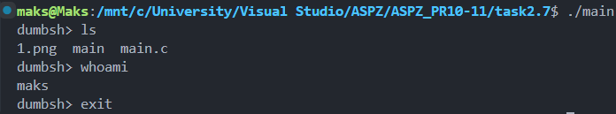
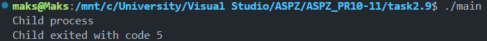
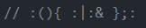
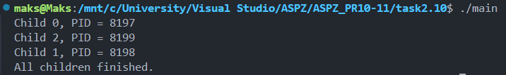
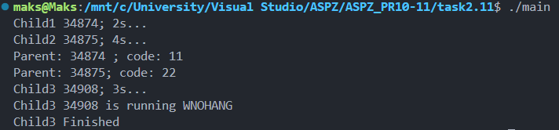

# Завдання 2.7-2.8

## Dumb Shell

#### Реалізувати просту оболонку, яка дозволяє виконувати команди користувача за допомогою `fork()` та `execlp()`.

## Рішення

#### Програма на початку використовує цикл `while(1)` для отримання команд від користувача, для цього вона зчитує команди з терміналу за допомогою `fgets()`, далі створює дочірній процес, щоб у разі помилки, вивелось повідомлення про неї, а сама програма продовжила працювати. Дочірній процес створюється за допомогою `fork()`, а команди користувача виконуються через `execlp()` й очікується закінчення процесу через `wait()`. Щоб вийти можна викликати `exit()` через термінал.



---
# Завдання 2.9

## API wait() 

### У цьому завданні програма демонструє, як дізнатись у батьківському процесі з яким кодом завершився дочірній процес.

## Рішення

#### На початку програми ми створюємо дочірній процес `fork()` й виходимо з нього з помилкою `exit(5)`, далі батьківський процес очікує завершення дочірнього через `wait(&status)` та перевіряє, чи нормально завершився процес, якщо так, то відповідно виводимо його помилку через `WEXITSTATUS(status)`.



---
# Завдання 2.10

## ForkBomb та Створення декількох дітей

### Рішення

#### Перша програма, це bash код, що виконує програму, що буде рекурсивно викликати саму себе, при цьому збільшуючи кількість процесів. Це відбувається таким чином, спочатку ми ініціалізуємо функцію `:() {}` та в ній відповідно запускаємо 2 таких самих процеси через `{:|: &}`, де `&` означає, що функції викликаються як фонові. Після визначення функції слідує її виклик через `:`. Це призводить до перевантаження системи, через рекурсивний виклик функції, що збільшує кількість процесів до нескінченності.



#### У другій програмі відбувається створення декількох дочірніх процесів (дітей). На початку маємо цикл, що виконується 3 рази, під час кожної ітерації, викликається `fork()`, що створює 1 дочірній процес до батьківського, після чого `pid` дочірнього процесу виводиться в консоль. В кінці програми, після циклу, очікуємо закінчення всіх дочірніх процесів через `while(wait(NULL)>0)` й закінчуємо програму.



---
# Завдання 2.11

## Варіанти використання wait
### Умова

```c
wait(NULL); // будь-який дочірній

waitpid(-1, &status, 0); // еквівалент wait

waitpid(pid, &status, 0); // конкретний процес

waitpid(pid, &status, WNOHANG); // не блокує
```

### Рішення

#### Для того, щоб перевірити 4 варіанти використання, було написано програму, де на початку створюються 2 дочірні процеси і їм задається час сну через `sleep()`, 2 та 4 секунди відповідно. Це зроблено для демонстрацію варіантів використання `wait()`. Далі програма отримує перший процес, що закінчився через `wait(&status)`, що є аналогічним до `wait(NULL)`. Для перевірки 3 прикладу виконується `waitpid(pid2, &status, 0)`, після чого виводиться повідомлення цього процесу. І для перевірки останнього прикладу використання, було зроблено новий процес, що має час сну 3 секунди, після чого викликаємо `waitpid(pid3, &nohang_status, WNOHANG)`, цей елемент коду дозволяє не блокувати програму, щоб вона виконувалась далі. Щоб перевірити це в кінці коду викликається `waitpid(pid3, &nohang_status, 0)`, що блокує програму і дозволяє краще зрозуміти, коли програма закінчиться.




---
# Завдання 3

## Використання двох fork()

### Рішення

#### Ця програма демонструє, як змінюється кількість дочірніх процесів та їх структура, при подвійному виклику `fork()`. На початку відповідно до консолі ми маємо лише батьківський процес з `PID: 10094`. Після першого виклику `fork()` створюється процес з `PID: 10095`. Обидва ці процеси (`10094 і 10095`) виконують другий `fork()`, що для кожного з них створює по дочірньому процесу. Таким чином маємо таку кінцеву структуру з 4 процесів:

- 10094
	- 10095 (fork #1)
		- 10097 (fork #2)
	- 10096 (fork #2)


